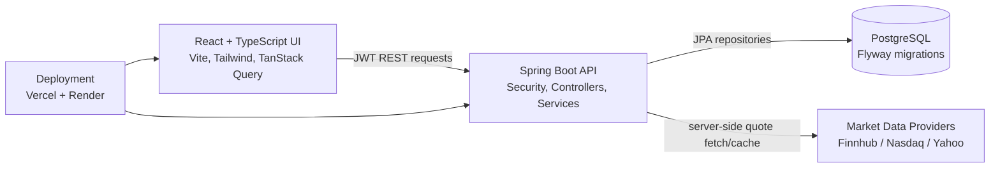

# LedgerOne

Full-stack stock paper-trading platform with live quote search, buying-power checks, watchlists, trade history, JWT authentication, admin review tools, and a Spring Boot/PostgreSQL backend.

[Live App](https://ledger-one-mocha.vercel.app) · [Backend Health](https://ledgerone-api-litx.onrender.com/actuator/health) · [API Status](https://ledgerone-api-litx.onrender.com/api/system/status)


## Overview

LedgerOne is a production-style paper trading app. A user signs in, receives one funded paper trading account with `$100,000` buying power, searches real stock symbols, reviews live quote data, places simulated buy/sell orders, tracks holdings, and monitors risk/account activity.

The goal is not to be a brokerage. It is a recruiter-ready full-stack fintech project that demonstrates secure authentication, transactional backend workflows, database-backed trading state, live market-data integration, and a polished React dashboard.

## Highlights

- One paper trading account per user, funded with `$100,000` at registration
- Live stock search and quote refresh through the backend
- Finnhub support when `FINNHUB_API_KEY` is configured, with Nasdaq/Yahoo public fallbacks
- Market and limit orders with fees, filled/rejected/pending/cancelled states
- Buying-power validation before buy orders and share-availability validation before sell orders
- Holdings, cost basis, realized/unrealized P/L, risk score, allocation, and trade ledger
- Watchlist with live prices
- JWT access tokens, hashed refresh tokens, BCrypt password hashing, and role-based admin access
- PostgreSQL schema/versioning through Flyway migrations
- Admin views for users, orders, audit logs, and risk alerts
- Render backend Blueprint and Vercel frontend deployment

## Architecture



The backend is the source of truth. The React app never calls Finnhub directly and never trusts frontend-calculated prices for execution. The API refreshes quotes before order placement and records orders, ledger transactions, holdings, notifications, audit logs, and risk alerts in PostgreSQL.

## Backend Design

The Spring Boot code is organized by ownership boundary:

| Package | Responsibility |
| --- | --- |
| `controller` | REST endpoints, validation, response envelopes |
| `service` | Transactional business rules for auth, trading, market data, risk, accounts |
| `repository` | Spring Data JPA persistence |
| `entity` | JPA domain model: users, stocks, holdings, orders, ledger transactions |
| `dto` | Public API request/response contracts |
| `security` | JWT filter, current-user access, role checks |
| `audit`, `notification`, `risk`, `scheduler` | Operational and domain support services |
| `db/migration` | Forward-only Flyway schema and data migrations |

Important backend rules:

- Only one active paper account is allowed per user.
- Buy orders require enough cash after estimated fees.
- Sell orders require enough shares.
- Duplicate `clientOrderId` requests return the existing order.
- Executed orders update cash, holdings, ledger transactions, notifications, risk, and audit logs inside transactional services.
- Live quote failures surface as API errors instead of silently using fake prices.

## Frontend Design

The frontend is a Vite React app with:

- Protected routes for overview, account, trading, watchlist, and admin screens
- TanStack Query for server state, refetching, and cache invalidation
- React Hook Form for login, registration, watchlist, and order forms
- Recharts for account performance/allocation visuals
- Tailwind CSS and Lucide icons for a focused dark fintech interface
- Demo fallback data for local review when the backend is sleeping or unavailable

## Data Flow

1. User registers or signs in.
2. Backend issues JWT access token and opaque refresh token.
3. Backend creates/fetches the user's single funded paper account.
4. User searches a ticker.
5. Backend fetches quote/search data from Finnhub first when configured, then public fallbacks.
6. User places a buy/sell order.
7. Trading service validates account ownership, cash/shares, order type, price, and fees.
8. Database records order, holdings update, ledger transaction, notification, audit log, and risk evaluation.
9. React invalidates account/dashboard/order queries and shows updated buying power.

## Tech Stack

| Layer | Technology |
| --- | --- |
| Backend | Java 21, Spring Boot 3.5, Spring Security, Spring Data JPA, Flyway |
| Database | PostgreSQL |
| Frontend | React, TypeScript, Vite, Tailwind CSS, React Router |
| Data/UI | TanStack Query, Axios, React Hook Form, Recharts, Lucide |
| Testing | JUnit 5, Mockito, Maven, Oxlint, TypeScript build |
| Deployment | Docker, Render Blueprint, Vercel, GitHub |

## Demo Accounts

| Role | Email | Password |
| --- | --- | --- |
| User | `user@ledgerone.com` | `User123!` |
| Admin | `admin@ledgerone.com` | `Admin123!` |

## Run Locally

Start PostgreSQL and both apps with Docker:

```bash
docker compose up --build
```

Then open:

- Frontend: `http://localhost:5173`
- Backend API: `http://localhost:8080/api`
- API status: `http://localhost:8080/api/system/status`
- Swagger UI: `http://localhost:8080/swagger-ui.html`

Run services manually:

```bash
cd backend
./mvnw spring-boot:run
```

```bash
cd frontend
npm install
npm run dev
```

Default local database:

```text
jdbc:postgresql://localhost:5432/ledgerone
```

## Environment Variables

Backend:

```bash
DATABASE_URL=
DATABASE_JDBC_URL=jdbc:postgresql://localhost:5432/ledgerone
DATABASE_USERNAME=ledgerone
DATABASE_PASSWORD=ledgerone
JWT_SECRET=change-this-in-production
ALLOWED_ORIGINS=http://localhost:5173,http://127.0.0.1:5173
MARKET_LIVE_PRICES_ENABLED=true
MARKET_QUOTE_CACHE_SECONDS=60
FINNHUB_API_KEY=
FINNHUB_BASE_URL=https://finnhub.io/api/v1
MARKET_QUOTE_URL_TEMPLATE=https://api.nasdaq.com/api/quote/{symbol}/info?assetclass=stocks
```

Frontend:

```bash
VITE_API_BASE_URL=http://localhost:8080/api
```

Keep `FINNHUB_API_KEY` only on the backend. Do not expose it in Vercel, React, or client-side code.

## Verification

```bash
cd backend
./mvnw test
```

```bash
cd frontend
npm run lint
npm run build
```

Current focused test coverage includes JWT, Render database URL conversion, quote parsing/cache behavior, ticker validation, risk calculation, and trading/portfolio service workflows.

## Deployment

- Backend: Render Blueprint from `render.yaml`
- Database: Render managed PostgreSQL
- Frontend: Vercel project with root directory `frontend`
- Frontend env: `VITE_API_BASE_URL=https://ledgerone-api-litx.onrender.com/api`
- Backend CORS: `ALLOWED_ORIGINS=https://ledger-one-mocha.vercel.app,http://localhost:5173,http://127.0.0.1:5173`

See [DEPLOYMENT.md](DEPLOYMENT.md) for the step-by-step Render and Vercel workflow.

## API Surface

Representative endpoints:

| Method | Endpoint | Purpose |
| --- | --- | --- |
| `POST` | `/api/auth/register` | Create user and funded paper account |
| `POST` | `/api/auth/login` | Authenticate and receive JWT/refresh token |
| `GET` | `/api/account/summary` | Buying power and total equity |
| `GET` | `/api/dashboard` | Account metrics, chart data, recent activity, risk |
| `GET` | `/api/market/stocks/search?query=AAPL` | Live symbol search |
| `GET` | `/api/market/stocks/{symbol}` | Live quote |
| `POST` | `/api/orders` | Place paper buy/sell order |
| `POST` | `/api/orders/{orderId}/cancel` | Cancel pending order |
| `GET` | `/api/watchlist` | User watchlist |
| `GET` | `/api/admin/users` | Admin user review |
| `GET` | `/api/admin/audit-logs` | Admin audit trail |

## Resume Summary

LedgerOne is a full-stack stock paper-trading platform built with React, TypeScript, Spring Boot, PostgreSQL, JWT auth, Flyway, and live market-data integrations. It supports a funded single-account trading model, live stock search, buy/sell execution, buying-power validation, holdings and P/L tracking, watchlists, admin/audit workflows, and deployment across Vercel and Render.
