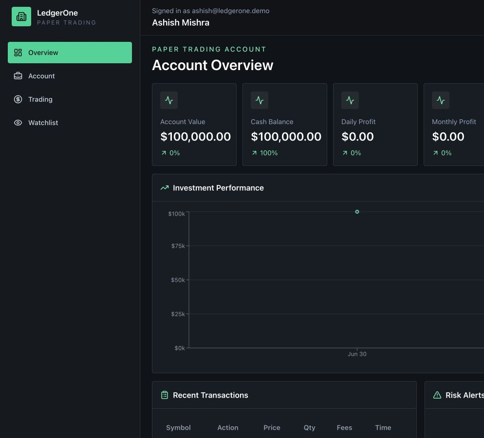

# LedgerOne

Enterprise investment portfolio and order management platform built with Spring Boot, React, PostgreSQL, JWT authentication, live equity quotes, risk analytics, and Render/Vercel deployment.

[Live Frontend](https://ledger-one-mocha.vercel.app) · [Backend Health](https://ledgerone-api-litx.onrender.com/actuator/health) · [API Status](https://ledgerone-api-litx.onrender.com/api/system/status)



## Overview

LedgerOne simulates an internal investment management platform for paper-account operations, trading workflows, risk review, and audit visibility. It is designed as an enterprise-style full-stack project: backend rules and persistence are treated as the source of truth, while the frontend presents a quiet, operations-focused dashboard for repeated use.

The project is free to run. It does not require paid brokerage or crypto APIs. The backend refreshes equity prices from Nasdaq's public quote endpoint with a short server-side cache, and seed data remains available for local demos when live quotes are disabled.

## Product Surface

- Single paper trading account funded at registration with buying power, market value, allocation, and risk score
- Holdings, cost basis, realized P/L, unrealized P/L, and allocation analytics
- Market and limit orders with pending, filled, cancelled, and rejected states
- Duplicate-safe order placement through `clientOrderId`
- Watchlist and live equity prices with server-side quote caching
- Admin views for users, orders, risk alerts, and audit logs
- JWT access tokens with hashed opaque refresh tokens
- Flyway-managed PostgreSQL schema and seed data
- Render backend blueprint and Vercel frontend deployment

## Stack

| Layer | Technology |
| --- | --- |
| Backend | Java 21, Spring Boot 3.5, Spring Security, Spring Data JPA, Flyway |
| Database | PostgreSQL |
| Frontend | React, Vite, TypeScript, Tailwind CSS, React Router |
| Data/UI | TanStack Query, Axios, React Hook Form, Recharts, Lucide icons |
| Testing | JUnit 5, Mockito, Maven, ESLint |
| Deployment | Docker, Render, Vercel, GitHub Actions |

## Demo Accounts

| Role | Email | Password |
| --- | --- | --- |
| Admin | `admin@ledgerone.com` | `Admin123!` |
| User | `user@ledgerone.com` | `User123!` |

## Architecture

The backend package boundaries mirror enterprise service ownership:

- `controller`: REST APIs with validation and response envelopes
- `service`: transactional business workflows
- `repository`: Spring Data persistence boundaries
- `entity`: JPA entities, never exposed directly
- `dto`: external request/response contracts
- `mapper`: MapStruct DTO mapping
- `security`: JWT, refresh tokens, roles, current-user access
- `audit`, `risk`, `notification`, `scheduler`: domain and operational capabilities
- `exception`, `validation`, `config`: platform concerns

Core business rules include:

- BCrypt password hashing and role-based authorization
- Buying power and share availability checks
- Order execution with fees, ledger transactions, holdings updates, and rejection reasons
- Paper-account performance, allocation, concentration, and risk scoring
- Live quote refresh, persisted price history, and optional local market simulation
- Admin audit trail for sensitive actions

## Run With Docker

```bash
docker compose up --build
```

Then open:

- Frontend: `http://localhost:5173`
- Backend API: `http://localhost:8080/api`
- API status: `http://localhost:8080/api/system/status`
- Swagger UI: `http://localhost:8080/swagger-ui.html`

## Run Locally

Backend:

```bash
cd backend
./mvnw spring-boot:run
```

Frontend:

```bash
cd frontend
npm install
npm run dev
```

PostgreSQL is expected at `jdbc:postgresql://localhost:5432/ledgerone` unless overridden with environment variables. Flyway creates and seeds the schema on startup.

Market data defaults:

```bash
MARKET_LIVE_PRICES_ENABLED=true
MARKET_QUOTE_CACHE_SECONDS=60
FINNHUB_API_KEY=
FINNHUB_BASE_URL=https://finnhub.io/api/v1
MARKET_QUOTE_URL_TEMPLATE=https://api.nasdaq.com/api/quote/{symbol}/info?assetclass=stocks
```

When live prices are enabled, the backend refreshes stock quotes before returning the stock list and before accepting an order. If `FINNHUB_API_KEY` is configured, Finnhub is used first for quotes, symbol search, and profile metadata. Nasdaq/Yahoo public quote providers remain as graceful fallback sources so local demos still work without a secret. If every quote source is unavailable, order placement returns a visible API error instead of using a fake price. Set `MARKET_LIVE_PRICES_ENABLED=false` only for fully local offline demos.

## Verification

```bash
cd backend
./mvnw test

cd ../frontend
npm run lint
npm run build
```

The frontend includes demo fallback data so the dashboard remains reviewable while the backend is sleeping or temporarily unavailable. When the backend is reachable from the browser, Axios and TanStack Query use the live REST APIs.

## Deployment

Use [DEPLOYMENT.md](DEPLOYMENT.md) for the Render backend and Vercel frontend workflow.

Current production configuration:

- Frontend: `https://ledger-one-mocha.vercel.app`
- Backend: `https://ledgerone-api-litx.onrender.com`
- Frontend env: `VITE_API_BASE_URL=https://ledgerone-api-litx.onrender.com/api`
- Backend CORS: `ALLOWED_ORIGINS=https://ledger-one-mocha.vercel.app,http://localhost:5173,http://127.0.0.1:5173`

## Beyond The Prompt

- Self-hosted API status endpoint and live/demo mode indicator in the UI
- Single-account trading model that creates one funded paper account at registration and blocks extra account creation
- Render-compatible database URL handling for managed PostgreSQL
- Forward-only Flyway repair migration for refresh-token schema drift
- Focused trading service tests for duplicate requests, persisted rejections, cash updates, holdings, ledger writes, and risk hooks
- Operational health endpoint through Spring Actuator
- Dockerized frontend reverse proxy to the backend API
